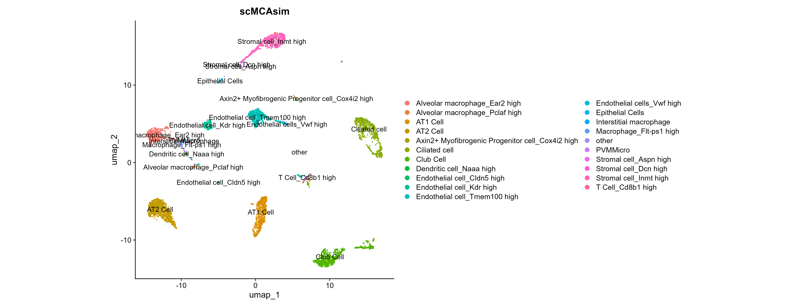

# scMCAlite

**A simplized version of R package scMCA, only keep *scMCA* function and make it much faster!**

The origianl R package scMCA is [here](https://github.com/ggjlab/scMCA).

### Installation

```R
# devtools required
> install.packages("devtools")
> devtools::install_github("sajuukLyu/scMCAlite")
```

### Quick Start

Take `lung5k` dataset from [10x](https://www.10xgenomics.com/datasets/5k-adult-mouse-lung-nuclei-isolated-with-chromium-nuclei-isolation-kit-3-1-standard) for example.

```R
> library(scMCAlite)
> library(Seurat)
> library(tidyverse)
> library(magrittr)

> data(lung5k)
> lung5k
# An object of class Seurat 
# 32285 features across 5083 samples within 1 assay 
# Active assay: RNA (32285 features, 2000 variable features)
#  2 layers present: counts, data
#  2 dimensional reductions calculated: pca, umap
```

Like scMCA, scMCAlite requires parameter `scdata`,  the query dataset, normalized single-cell gene expression matrix-like object with each row a gene and each column a cell.

```R
> mca_test <- lung5k[["RNA"]]$data
> dim(mca_test)
# [1] 32285  5083

> mca_result <- scMCAlite(scdata = mca_test, num = 3)
# 2797 genes used, calculating correlation coefficient...
# 138 types expected, extracting top 3 results...
```

The return of scMCAlite() is a list which contains 4 parts, very similar to scMCA().

- cors_matrix: the pearson correlation coefficient matrix of each cell and cell type.
- top_cors: equals to `num`.
- scMCA: the most relevant cell type for each query cell.
- scMCA_similarity: the top n relevant cell types for each query cell.

```R
> mca_result$scMCA %>% table %>% length
# [1] 63
```

There is always too much annotated celltypes with only few cells, we can simplify the results for better usage.

```R
> mca_sim <- mca_result$scMCA %>% str_remove("\\:.*")
> mca_sim[mca_sim %in% (table(mca_sim) %>% {names(.)[. <= 10]})] <- "other"
> mca_sim %>% table %>% length
# [1] 21

> lung5k$scMCAsim <- mca_sim
```

### Performance



scMCAlite runs about 100 times faster than scMCA with the same input dataset (5000 cells).  scMCAlite can save much much more time with larger input dataset!

```R
> system.time(scMCAlite(scdata = mca_test, num = 3))
#  user    system  elapsed 
#  4.33   0.04   10.61
> system.time(scMCA::scMCA(scdata = mca_test, numbers_plot = 3))
#  user    system  elapsed 
#  234.04   31.04   1039.62
```

